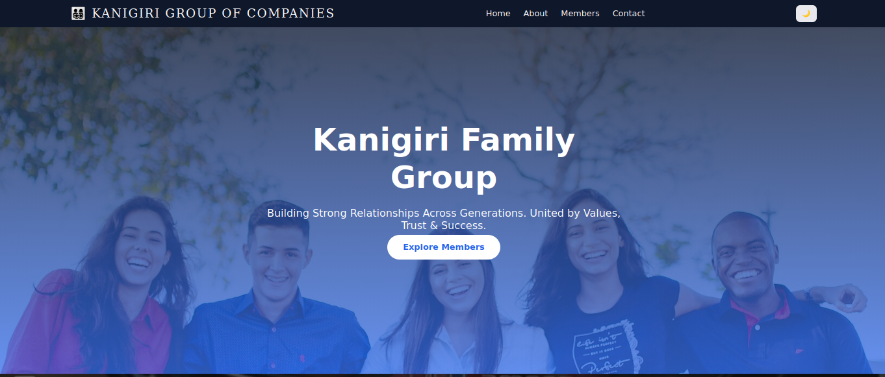
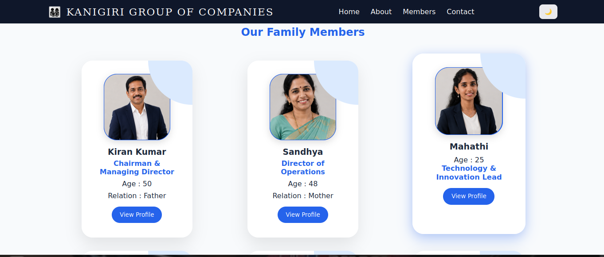
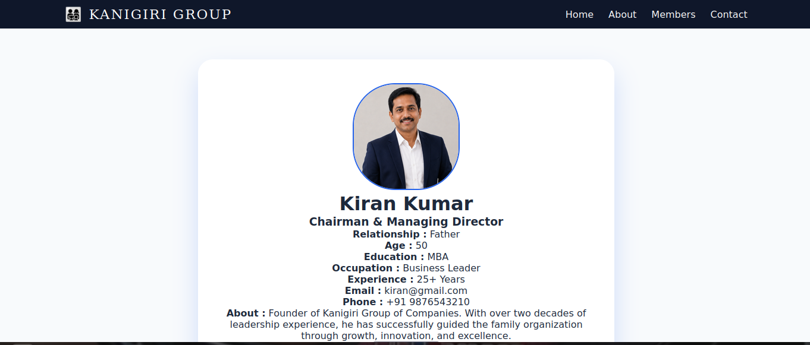
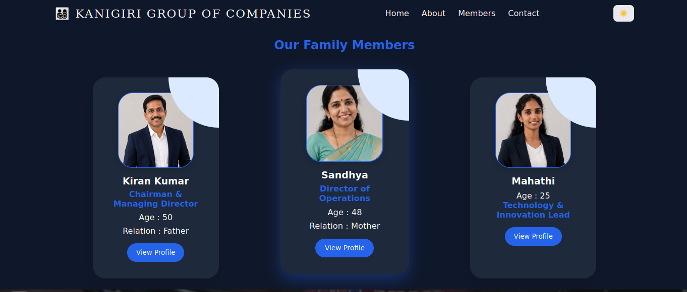

# 👨‍👩‍👧‍👦 Family Showcase Website

A modern and responsive Family Showcase website developed using "HTML5", "CSS3", and "JavaScript". The website provides an elegant way to present family member information through a clean, interactive, and responsive user interface.

---

## 📖 Overview

The Family Showcase Website is a frontend web development project that displays family member information in a visually appealing and organized manner. Users can explore the website, view family members, and access detailed profile information through a dynamic profile page.

---

## ✨ Features

- 🎨 Modern and responsive user interface
- 🌙 Dark Mode support
- 👨‍👩‍👧‍👦 Dynamic family member profile display
- ⚡ JavaScript-based content rendering
- 🧭 Interactive navigation
- 📱 Responsive layout for different screen sizes
- 💙 Clean and user-friendly design

---

## 🛠️ Technologies Used

- HTML5
- CSS3
- JavaScript (ES6)

---

## 📂 Project Structure

```
family-showcase/
│── index.html
│── profile.html
│── style.css
│── script.js
│── profile.js
```

---

## 📸 Screenshots

### 🏠 Home Page



---

### 👨‍👩‍👧‍👦 Family Members Section



---

### 👤 Member Profile



---

### 🌙 Dark Mode



---

## 🚀 Getting Started

1. Clone this repository

```bash
git clone https://github.com/YOUR_USERNAME/family-showcase.git
```

2. Open `index.html` in your preferred web browser.

No installation or additional dependencies are required.

---

## 👩‍💻 Author

" Mahathi Kanigiri "

Computer Science Engineering Undergraduate  
Minor in Quantum Technology
